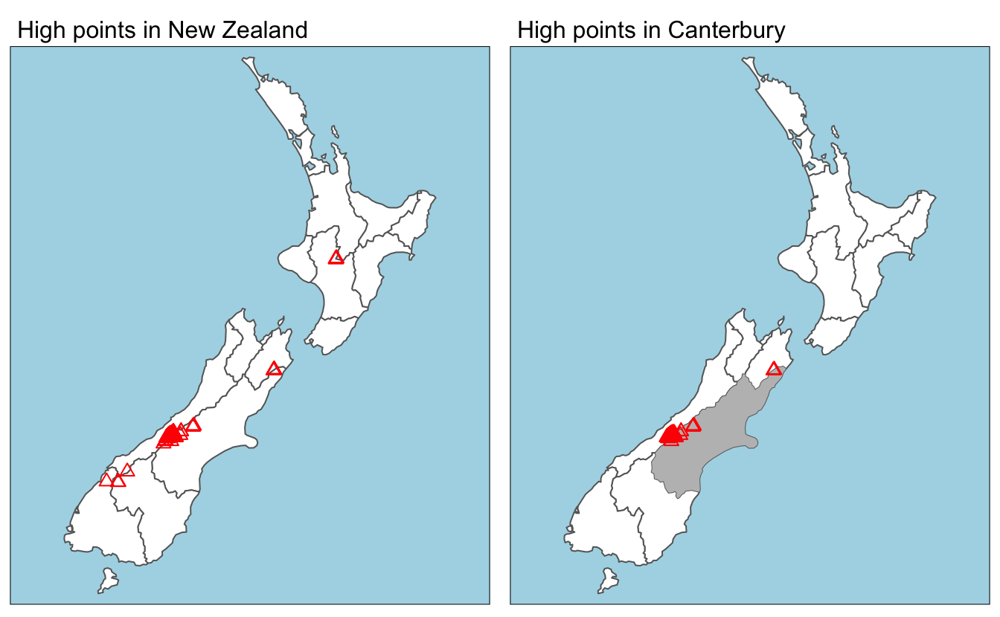
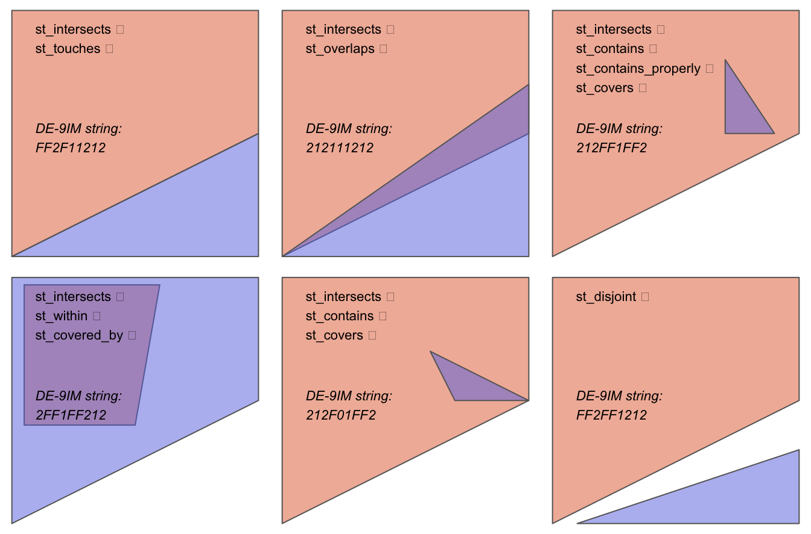

# Spatial data operations

## **Learning objectives Spatial Operations on Vectors**

-   Understand Spatial Operations

    -   subsetting / joining on spatial objects

        -   equivalence to non-spatial attributes from previous chapters

-   Spatial Joins - Methods

    -   intersection

    -   within a distance

-   Spatial Operations on Vectors - uses [sf vignette](https://r-spatial.github.io/sf/articles/) (simple features package)

-   Spatial Subsetting

    -   start with a spatial object and return new object containing only features that relate in space to another object

## Learning Objectives Spatial Operations on Rasters

-   subsetting with Raster data -terra package
    -   clipping raster 1 falls within extent of second raster
    -   masking - logical raster w/ T/F values subsets the other raster
    -   map algebra - operations that modify or summarize raster cell values with reference to surrounding cells, zones or stat functions that apply to every cell
        -   Four Sub classes of map algebra
            -   Local (per cell)
            -   Focal (neighborhood operations)
            -   Zonal (surrounding pixel grid - can be irregular size/shape)
            -   Global (one or several entire rasters)
        -   Equate the map algebra operations to their vector processing counterparts
        -   Merging Rasters

## SLIDE Vectors Spatial Subsetting

-   subsets of sf dataframes - select and return only features related in space to another object

    -   square bracket (`[`) operator using the syntax `x[y, , op = st_intersects]`

    -   st_intersects - is default

        -   'catch all' topological relation that will return features in the target that *touch*, *cross* or are *within* the source 'subsetting' object

    -   op = st_disjoint - is opposite - points that DO NOT intersect with source

-   4.2.1 Demo of Spatial subsetting - view code and output in main book 04 RMD doc

    -   book example - spData for sample data - NZ high points - point features and regions as polygons

    -   book uses dplyr filter function (tidyverse) for example



## SLIDE Vectors Topological Relations

-   Binary Topological Relationships
    -   Logical - Return TRUE or False about the spatial relationships between two objects defined by ordered sets of points - (typically points,lines,polygons)

    -   Fig 4.2 graphic discussion view in book code

        -   Symmetrical relationships

        -   `function(x, y)` is true, `function(y, x)` will also be true, 

            -   *equals, intersects*, *crosses*, *touches* and *overlaps*

        -   When order of x.y is important - not symmetrical

        ```         
        -   contains, and within
        ```



## SLIDE Vectors Spatial Joining

-   Spatial joins are implemented with [`st_join()`](https://r-spatial.github.io/sf/reference/st_join.html)
    -   default - left join - all from x - left, including rows that DO NOT match y

        -   inner join - set left=FALSE

    -   default join for st_join() is st_intersects()

        -   can change - set the join argument

            -   (see [`?st_join`](https://r-spatial.github.io/sf/reference/st_join.html) for details)
-   Example Fig 4.6 - points join with the polygons that there are within
    -   Random points on World map - join the Country name (polygon attribute) that the point is within
-   non overlapping join example
    -    use the binary predicate [`st_is_within_distance()`](https://r-spatial.github.io/sf/reference/geos_binary_pred.html)

## SLIDE Vectors - Spatial Aggregation

-   condenses data

-   mean, average or sum - return single value per grouping variable - like Section [3.2.3](https://r.geocompx.org/attr.html#vector-attribute-aggregation) 

-   Book revisits NZ earlier example and aggregates average value of height of the features. Fig 4.8

## SLIDE Vectors - Spatial Congruence

-   y (aggregating object) is ... to target object (x)

    -   Congruent - two objects have shared borders

    -   Incongruent - do not share common borders

-   Solution - *area weighted* spatial interpolation

    -   transfers values from the `incongruent` object to a new column in `aggregating_zones` in proportion with the area of overlap: the larger the spatial intersection between input and output features,

    -   [st_interpolate_aw()](https://r-spatial.github.io/sf/reference/interpolate_aw.html)

        -   example in book. 4.9

## SLIDE Vectors - Distance Relations

-   Distance relations are continuous

-   The distance between two objects is calculated with the [`st_distance()`](https://r-spatial.github.io/sf/reference/geos_measures.html) function

    -   result has units

    -   returned as a matrix so...

        -    return *distance matrices* between all combinations of features in objects `x` and `y`

## SLIDE Rasters 1 4.3

-   Subsetting
    -   Clipping
    -   Masking
-   Local Operations
    -   Raster algebra. - adding, subtracting, squaring, multiplying, logical filter ex \>5 example
        -   terra examples in Fig 4.11
        -   classification of intervals of numeric values into groups - ex DEM
            -   classify() with a reclassifaction matrix making the 3 groupings (1/2/3 low/middle/high)
            -   more efficient functions: app(), tapp(), lapp()
                -   app() - applies a function to each cell of a raster
                    -   used to summarize - calculating the sum of multiple layers into one layer
                -   tapp() - an extension of app() which allows selecting a subset of layers
                -   lapp() - apply a function to each cell using layers as an argument
                    -   NDVI - **N**ormalized **D**ifference **V**egetation **I**ndex is example using lapp() in raster algebra - see fig 4.12 example
-   Focal Operations
    -   central (focal) cell and its neighbors
        -   neighborhood -(also called kernel, filter, or moving window)
            -   typical example a 3x3 rectangular matrix around the central / focal cell
    -   applies aggregation function
        -   also called spatial filtering or convolution
        -   focal() function in R
            -   matrix defines the shape of the moving window - w weight in example
            -   fun - function example uses min - but other summary functions like sum(), mean(), var() can be used
            -   additional arguments - remove NA=True na.rm=TRUE or False na.rm=FALSE - see Fig 4.13
-   Zonal Operations
    -   2nd raster usually with categorical values defines the zonal filter or zones
        -   so don't have to be neighbors
        -   Output is summary table grouped by the categorical values
        -   called Zonal Statistics in GIS world
-   Global Operations and Distances
    -   special case of Zonal operations with entire raster representing a single zone
        -   Descriptive statistics for entire raster such as Min or Max
        -   useful for calculation of distance from each cell to a target cell
        -   also includes Visibility and View shed computations

## Slide Raster - Vector Processing Counterparts

| Function             | Raster         | Vector           |
|----------------------|----------------|------------------|
| Computing a Distance | Global         | Buffer Operation |
| Reclassifying        | local or zonal | dissolving       |
| Overlaying           | local          | clipping         |

## Merging Rasters

-   terra merge() function combines two images

    -   if they overlap uses value of first raster

-   when combining spectral imagery - may be better to use mosaic() command

## Meeting Videos

## Cohort 1

`r knitr::include_url("https://www.youtube.com/embed/Rw2rcxjuMpw")`

<details>

<summary>Meeting chat log</summary>

```         
00:33:37    Derek Sollberger:   (just adding this current link to the chat) https://en.wikipedia.org/wiki/DE-9IM
00:37:07    Olivier Leroy:  Reacted to "(just adding this cu..." with 👍
00:38:49    Olivier Leroy:  I write a bit here https://www.branchtwigleaf.com/post/2021-12-23-toying-with-de9im/
00:53:05    Olivier Leroy:  lapply()
01:07:40    Derek Sollberger:   Reacted to "I write a bit here h..." with 👍
01:15:59    Derek Sollberger:   Have you seen the GitHub instructions at https://github.com/r4ds/bookclub-geocompr ?
```

</details>
