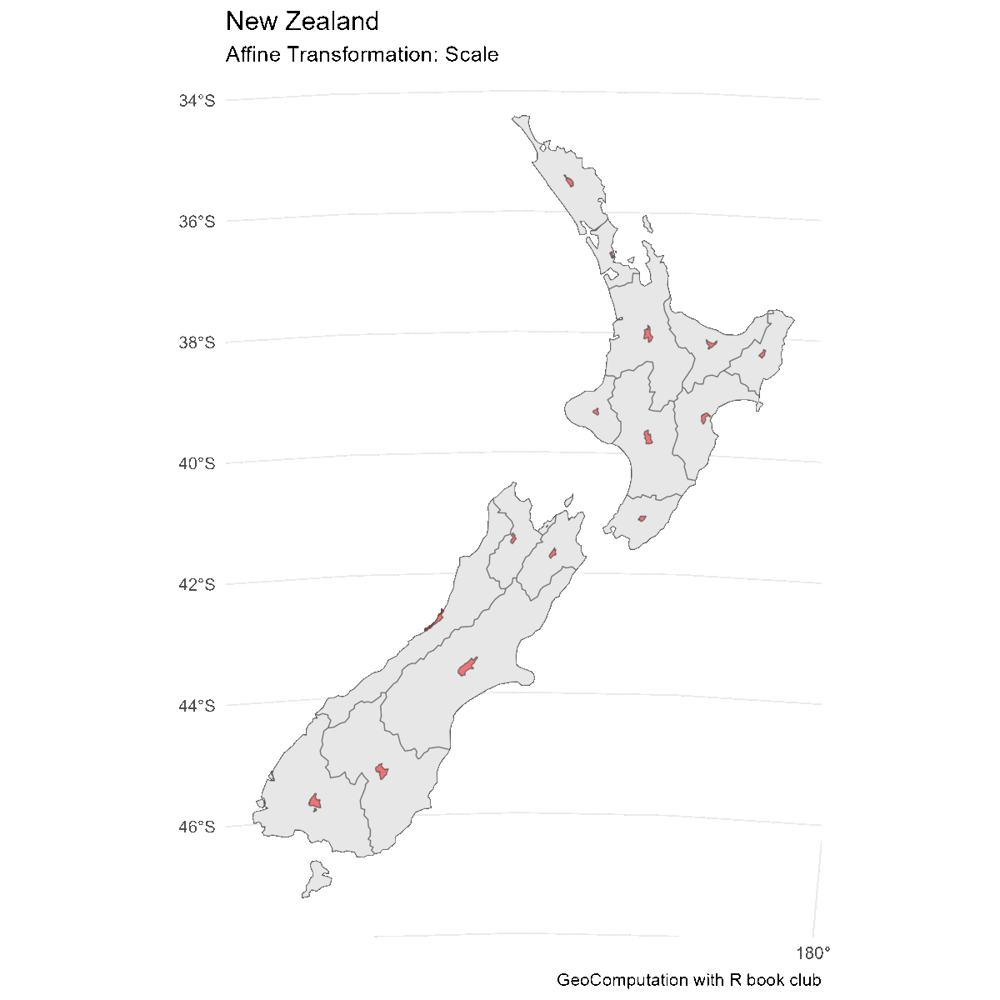

# Geometry operations

**Learning objectives:**

* downsample vector data
* gain overview of various geometry operations for vector data
* downsample and upsample raster data

```{r ch5_packages, message = FALSE, warning = FALSE}
library("sf")
library("spData")
library("spDataLarge")
library("terra")
library("tidyverse")
```


## Vector Data

* exploring the `geometry` aspects of our data
* functions work on `sf` and `sfc` objects

## Simplifying Lines

```{r}
# original data
seine |>
  ggplot() +
  geom_sf(aes(color = name)) +
  labs(title = "La Seine",
       subtitle = "Rivers in France",
       caption = "GeoComputation with R book club") +
  theme_minimal()
```

```{r, echo = TRUE}
seine_simp_1000 = st_simplify(seine, dTolerance = 1000)  #1000 meters
seine_simp_1000 |>
  ggplot() +
  geom_sf() +
  labs(title = "La Seine",
       subtitle = "resolution: 1000 meters",
       caption = "GeoComputation with R book club") +
  theme_minimal()
```

```{r, echo = FALSE}
seine_simp_2000 = st_simplify(seine, dTolerance = 2000)  #2000 meters
seine_simp_2000 |>
  ggplot() +
  geom_sf() +
  labs(title = "La Seine",
       subtitle = "resolution: 2000 meters",
       caption = "GeoComputation with R book club") +
  theme_minimal()
```

```{r, echo = FALSE}
seine_simp_4000 = st_simplify(seine, dTolerance = 4000)  #4000 meters
seine_simp_4000 |>
  ggplot() +
  geom_sf() +
  labs(title = "La Seine",
       subtitle = "resolution: 4000 meters",
       caption = "GeoComputation with R book club") +
  theme_minimal()
```

```{r, echo = FALSE}
seine_simp_8000 = st_simplify(seine, dTolerance = 8000)  #8000 meters
seine_simp_8000 |>
  ggplot() +
  geom_sf() +
  labs(title = "La Seine",
       subtitle = "resolution: 8000 meters",
       caption = "GeoComputation with R book club") +
  theme_minimal()
```
```{r}
object.size(seine)
object.size(seine_simp_1000)
object.size(seine_simp_2000)
object.size(seine_simp_4000)
object.size(seine_simp_8000)
```


## Simplifying Polygons

```{r}
# original data
us_states2163 = st_transform(us_states, "EPSG:2163")
us_states2163 |>
  ggplot() +
  geom_sf() +
  labs(title = "United States",
       subtitle = "continental United States",
       caption = "GeoComputation with R book club") +
  theme_minimal()
```
```{r, echo = TRUE}
us_states2163_simp_1 = st_simplify(us_states2163, 
                                   dTolerance = 1e3)  #1 kilometer
us_states2163_simp_1 |>
  ggplot() +
  geom_sf() +
  labs(title = "United States",
       subtitle = "resolution: 1 kilometer",
       caption = "GeoComputation with R book club") +
  theme_minimal()
```

```{r, echo = FALSE}
us_states2163_simp_10 = st_simplify(us_states2163, 
                                   dTolerance = 1e4)  #10 kilometers
us_states2163_simp_10 |>
  ggplot() +
  geom_sf() +
  labs(title = "United States",
       subtitle = "resolution: 10 kilometers",
       caption = "GeoComputation with R book club") +
  theme_minimal()
```

```{r, echo = FALSE}
us_states2163_simp_100 = st_simplify(us_states2163, 
                                   dTolerance = 1e5)  #100 kilometers
us_states2163_simp_100 |>
  ggplot() +
  geom_sf() +
  labs(title = "United States",
       subtitle = "resolution: 100 kilometers",
       caption = "GeoComputation with R book club") +
  theme_minimal()
```

```{r}
object.size(us_states2163)
object.size(us_states2163_simp_1)
object.size(us_states2163_simp_10)
object.size(us_states2163_simp_100)
```

### smoother algorithms

The `smoother` package offers other ways to simplify the data.

* `st_simplify` (Douglas-Peucker)
* `ms_simplify` (Visalingam)
* `smooth(method = ksmooth)` (Gaussian kernel regression with parameter `smoothness`)


## Centroids

Centroid operations identify the center of geographic objects.

* Analogous to mean/median/mode, there are different ways to calculate centroids (chapter 11)

```{r, echo = TRUE}
nz |>
  ggplot() +
  geom_sf() +
  labs(title = "New Zealand",
       subtitle = "where R was born!",
       caption = "GeoComputation with R book club") +
  theme_minimal()
```

```{r}
head(nz) #New Zealand
```

```{r}
nz_centroid = st_centroid(nz)
```

```{r, echo = TRUE}
nz |>
  ggplot() +
  geom_sf() +
  geom_sf(color = "red", data = nz_centroid) +
  labs(title = "New Zealand",
       subtitle = "centroids",
       caption = "GeoComputation with R book club") +
  theme_minimal()
```

```{r, echo = TRUE}
nz |>
  ggplot() +
  geom_sf() +
  geom_sf_label(data = nz_centroid,
                aes(label = Name)) +
  labs(title = "New Zealand",
       subtitle = "labels",
       caption = "GeoComputation with R book club") +
  theme_minimal()
```


## Buffers

```{r}
# original data
seine |>
  ggplot() +
  geom_sf(aes(color = name)) +
  labs(title = "La Seine",
       subtitle = "Rivers in France",
       caption = "GeoComputation with R book club") +
  theme_minimal()
```

```{r, echo = TRUE}
seine_buffer_5 = st_buffer(seine, dist = 5000)  #5 kilometers
seine |>
  ggplot() +
  geom_sf() +
  geom_sf(aes(fill = name), alpha = 0.5,
          data = seine_buffer_5) +
  labs(title = "La Seine",
       subtitle = "buffer: 5 kilometers",
       caption = "GeoComputation with R book club") +
  theme_minimal()
```

```{r, echo = TRUE}
seine_buffer_50 = st_buffer(seine, dist = 50000)  #50 kilometers
seine |>
  ggplot() +
  geom_sf() +
  geom_sf(aes(fill = name), alpha = 0.5,
          data = seine_buffer_50) +
  labs(title = "La Seine",
       subtitle = "buffer: 50 kilometers",
       caption = "GeoComputation with R book club") +
  theme_minimal()
```


## Shift

The sf package implements affine transformation for objects of classes `sfg` and `sfc`.

```{r}
nz_sfc = st_geometry(nz) #extracts geom column
```

```{r}
nz_shift_sfc = nz_sfc + c(1e5, 1e5) #shift by x = 10, y = 10 kilometers
nz_shift_sf = st_set_geometry(nz, nz_shift_sfc) #return to sf type
st_crs(nz_shift_sf) <- st_crs(nz) #ensure same coordinate system
nz |>
  ggplot() +
  geom_sf() +
  geom_sf(fill = "blue", alpha = 0.5,
          data = nz_shift_sf) +
  labs(title = "New Zealand",
       subtitle = "Affine Transformation: Shift",
       caption = "GeoComputation with R book club") +
  theme_minimal()
```

```{r, echo = FALSE, eval = FALSE}
offset_factors <- seq(-4, 4, 0.5)

for(i in 1:length(offset_factors)){
  k <- offset_factors[i]
  nz_shift_sfc = nz_sfc + c(k*1e5, k*1e5) #shift by x = 10, y = 10 kilometers
  nz_shift_sf = st_set_geometry(nz, nz_shift_sfc) #return to sf type
  st_crs(nz_shift_sf) <- st_crs(nz) #ensure same coordinate system
  this_plot <- nz |>
    ggplot() +
    geom_sf() +
    geom_sf(fill = "blue", alpha = 0.5,
            data = nz_shift_sf) +
    labs(title = "New Zealand",
         subtitle = "Affine Transformation: Shift",
         caption = "GeoComputation with R book club") +
    theme_minimal()  
  
  ggsave(filename = paste0("images/shift", i, ".png"),
         plot = this_plot,
         device = "png")
}


```


## Scale

```{r}
# get centroids
nz_centroid_sfc = st_centroid(nz_sfc)

#scale by factor of 0.5
nz_scale_sfc = (nz_sfc - nz_centroid_sfc) * 0.5 + nz_centroid_sfc 

nz_scale_sf = st_set_geometry(nz, nz_scale_sfc) #return to sf type
st_crs(nz_scale_sf) <- st_crs(nz) #ensure same coordinate system
nz |>
  ggplot() +
  geom_sf() +
  geom_sf(fill = "red", alpha = 0.5,
          data = nz_scale_sf) +
  labs(title = "New Zealand",
       subtitle = "Affine Transformation: Scale",
       caption = "GeoComputation with R book club") +
  theme_minimal()
```
```{r, echo = FALSE, eval = FALSE}
scale_factors <- seq(0.1, 2.0, 0.1)

for(i in 1:length(scale_factors)){
  k <- scale_factors[i]
  nz_scale_sfc = (nz_sfc - nz_centroid_sfc) * k + nz_centroid_sfc 
  
  nz_scale_sf = st_set_geometry(nz, nz_scale_sfc) #return to sf type
  st_crs(nz_scale_sf) <- st_crs(nz) #ensure same coordinate system
  this_plot <- nz |>
    ggplot() +
    geom_sf() +
    geom_sf(fill = "red", alpha = 0.5,
            data = nz_scale_sf) +
    labs(title = "New Zealand",
         subtitle = "Affine Transformation: Scale",
         caption = "GeoComputation with R book club") +
    theme_minimal() 
  
  ggsave(filename = paste0("images/scale", i, ".png"),
         plot = this_plot,
         device = "png")
}
```




## Rotate

```{r}
# get centroids
nz_centroid_sfc = st_centroid(nz_sfc)

rotation = function(a){
  r = a * pi / 180 #degrees to radians
  matrix(c(cos(r), sin(r), -sin(r), cos(r)), nrow = 2, ncol = 2)
} 

# rotate by 30 degrees
nz_rotate_sfc = (nz_sfc - nz_centroid_sfc) * rotation(30) + nz_centroid_sfc

nz_rotate_sf = st_set_geometry(nz, nz_rotate_sfc) #return to sf type
st_crs(nz_rotate_sf) <- st_crs(nz) #ensure same coordinate system
nz |>
  ggplot() +
  geom_sf() +
  geom_sf(fill = "green", alpha = 0.5,
          data = nz_rotate_sf) +
  labs(title = "New Zealand",
       subtitle = "Affine Transformation: Rotate",
       caption = "GeoComputation with R book club") +
  theme_minimal()
```

```{r, echo = FALSE, eval = FALSE}
rotation_angles <- seq(0, 360, 20)

for(i in 1:length(rotation_angles)){
  k <- rotation_angles[i]
  nz_rotate_sfc = (nz_sfc - nz_centroid_sfc) * rotation(k) + nz_centroid_sfc
  
  nz_rotate_sf = st_set_geometry(nz, nz_rotate_sfc) #return to sf type
  st_crs(nz_rotate_sf) <- st_crs(nz) #ensure same coordinate system
  this_plot <- nz |>
    ggplot() +
    geom_sf() +
    geom_sf(fill = "green", alpha = 0.5,
            data = nz_rotate_sf) +
    labs(title = "New Zealand",
         subtitle = "Affine Transformation: Rotate",
         caption = "GeoComputation with R book club") +
    theme_minimal()
  
  ggsave(filename = paste0("images/rotate", i, ".png"),
         plot = this_plot,
         device = "png")
}
```


## Clipping

### Intersection

```{r}
nz_intersection = st_intersection(nz, nz_shift_sf)

nz |>
  ggplot() +
  geom_sf(fill = "red", alpha = 0.25) +
  geom_sf(fill = "blue", alpha = 0.25,
          data = nz_shift_sf) +
  geom_sf(fill = "purple",
          data = nz_intersection) +
  labs(title = "New Zealand",
       subtitle = "Intersection",
       caption = "GeoComputation with R book club") +
  theme_minimal()
```

### Venn Diagrams


## Geometry Unions

```{r}
# us_states was the shapefile of the continental US states

# combining demographic information by regions
us_regions = us_states |> 
  group_by(REGION) |>
  summarize(pop = sum(total_pop_15, na.rm = TRUE))
```

```{r}
us_states |>
  ggplot() +
  geom_sf(aes(fill = total_pop_15)) +
  guides(fill=guide_legend(title="year 2015 population")) +
  labs(title = "United States",
       subtitle = "Year 2015 population",
       caption = "GeoComputation with R book club") +
  scale_fill_gradient(low = "orange", high = "green") +
  theme_minimal()
```

```{r}
us_regions |>
  ggplot() +
  geom_sf(aes(fill = pop)) +
  guides(fill=guide_legend(title="year 2015 population")) +
  labs(title = "United States Regions",
       subtitle = "Year 2015 population",
       caption = "GeoComputation with R book club") +
  scale_fill_gradient(low = "orange", high = "green") +
  theme_minimal()
```


## Type Transformations

```{r}
multipoint = st_multipoint(matrix(c(1, 3, 5, 1, 3, 1), ncol = 2))

multipoint |> ggplot() + geom_sf() + theme_minimal() +
  labs(title = "Multipoint")
```

```{r}
linestring = st_cast(multipoint, "LINESTRING")

linestring |> ggplot() + geom_sf() + theme_minimal() +
  labs(title = "Linestring")
```

```{r}
polyg = st_cast(multipoint, "POLYGON")

polyg |> ggplot() + geom_sf() + theme_minimal() +
  labs(title = "Polygon")
```
```{r}
multipoint_2 = st_cast(linestring, "MULTIPOINT")
multipoint_3 = st_cast(polyg, "MULTIPOINT")
all.equal(multipoint, multipoint_2)
all.equal(multipoint, multipoint_3)
```


### New Objects

```{r}
multilinestring_list = list(matrix(c(1, 4, 5, 3), ncol = 2), 
                            matrix(c(4, 4, 4, 1), ncol = 2),
                            matrix(c(2, 4, 2, 2), ncol = 2))
multilinestring = st_multilinestring(multilinestring_list)
multilinestring_sf = st_sf(geom = st_sfc(multilinestring))
multilinestring_sf
```


```{r}
multilinestring_sf |> ggplot() + geom_sf() + theme_minimal() +
  labs(title = "Multilinestring")
```

```{r}
linestring_sf2 = st_cast(multilinestring_sf, "LINESTRING")
linestring_sf2
```

## Attribute Creation

```{r}
linestring_sf2$name = c("Riddle Rd", "Marshall Ave", "Foulke St")
linestring_sf2$length = st_length(linestring_sf2)
linestring_sf2
```


```{r}
linestring_sf2 |> 
  ggplot() + 
  geom_sf(aes(color = name)) + 
  geom_sf_label(aes(label = name)) +
  labs(title = "Linestring") +
  theme_minimal() +
  theme(legend.position = "none") +
  xlim(0,5)
```


## Raster Data

* Geometric raster operations include the shift, flipping, mirroring, scaling, rotation or warping of images

* Variety of applications including georeferencing


## Extent

```{r}
elev = rast(system.file("raster/elev.tif", package = "spData"))
clip = rast(xmin = 0.9, xmax = 1.8, ymin = -0.45, ymax = 0.45,
            resolution = 0.3, vals = rep(1, 9))
elev[clip, drop = FALSE]
```

```{r}
plot(elev)
```


Following code adds one row and two columns to each side of the raster while setting all new values to `NA`

```{r}
elev_2 = extend(elev, c(1, 2))

plot(elev_2)
```
```{r, eval = FALSE}
# PRODUCES ERROR: extends do not match
elev_3 = elev + elev_2
```

```{r}
# correct implementation
elev_4 = extend(elev, elev_2)
```


## Origin

The origin of a raster is the cell corner closest to the coordinates `(0, 0)`

```{r}
origin(elev)
origin(elev_4)
```

We can also change the origin

```{r}
origin(elev_4) = c(0.25, 0.25)
```


## Aggregation

```{r}
dem = rast(system.file("raster/dem.tif", package = "spDataLarge"))
dem_agg = aggregate(dem, fact = 5, fun = mean) #or median, sum, etc.
```

```{r}
plot(dem)
```

```{r}
plot(dem_agg)
```

### Disaggregation

```{r}
dem_disagg = disagg(dem_agg, fact = 5, method = "bilinear") #default: "near"
plot(dem_disagg)
```

```{r}
identical(dem, dem_disagg)
```

## Resampling

What to do when we have two or more rasters with different resolutions and origins? This is the role of resampling – a process of computing values for *new pixel locations*.

* methods: nearest neighbor, bilinear interpolation, cubic interpolation, cubic spline interpolation, Lanzcos
* balance between quality and computational time

```{r}
target_rast = rast(xmin = 794650, xmax = 798250, 
                   ymin = 8931750, ymax = 8935350,
                   resolution = 300, crs = "EPSG:32717")
```

```{r}
plot(dem)
```
```{r}
plot(terra::resample(dem, y = target_rast, 
                     method = "near"))
```

```{r}
plot(terra::resample(dem, y = target_rast, 
                     method = "bilinear"))
```

```{r}
plot(terra::resample(dem, y = target_rast, 
                     method = "cubic"))
```

```{r}
plot(terra::resample(dem, y = target_rast, 
                     method = "cubicspline"))
```

```{r}
plot(terra::resample(dem, y = target_rast, 
                     method = "lanczos"))
```

## Meeting Videos

### Cohort 1

`r knitr::include_url("https://www.youtube.com/embed/zM4X1TS_EyU")`

<details>
<summary> Meeting chat log </summary>

```
00:04:05	Oluwafemi Oyedele:	Hi Tony!!!
00:04:17	Tony Vota:	Hi All
00:04:27	Derek Sollberger:	good afternoon
00:16:25	Olivier Leroy:	https://github.com/mbloch/mapshaper
00:18:35	Olivier Leroy:	New York Times journalist
00:20:52	Olivier Leroy:	https://en.wikipedia.org/wiki/Deception_Island an example were the centroid will give you a bad result :P
00:28:11	Olivier Leroy:	st_point_on_surface is the function that deal with centroid were point still need to be in the polygon
00:29:01	Olivier Leroy:	They are great!
00:29:16	Tony Vota:	Reacted to "They are great!" with 👍
00:29:25	Jonathan V. Solórzano Villegas:	yup, nice animations!
00:37:38	Olivier Leroy:	https://en.wikipedia.org/wiki/Modifiable_areal_unit_problem
00:44:06	Olivier Leroy:	Very useful in network: road/broadband infra/river etc
00:55:15	Jim Gruman:	thank you Derek. The animations were awesome
00:55:21	Tony Vota:	Great presentation.  Very clear.  Thanks!
01:00:38	Olivier Leroy:	https://github.com/r-spatial/sf/blob/7c860ccc5db719f04ed8c29a39595b46f6b3aad1/tests/cast.R
01:01:26	Olivier Leroy:	https://github.com/r-spatial/sf/blob/0b3d26f7ac8efd4a969d53c26bbb3d47d97a0829/R/cast_sfg.R
01:04:19	Olivier Leroy:	MULTIPOINT = st_multipoint(Tail1(unclass(x))[[1L]]),
```
</details>
