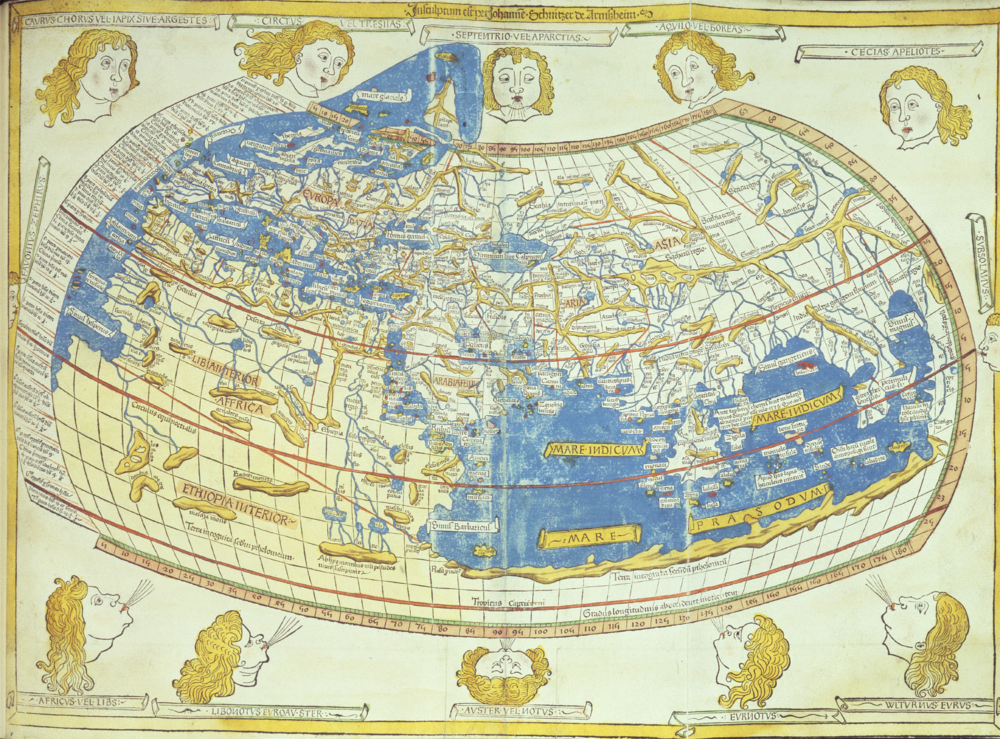
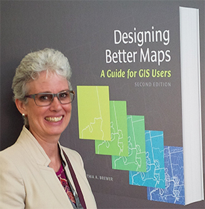
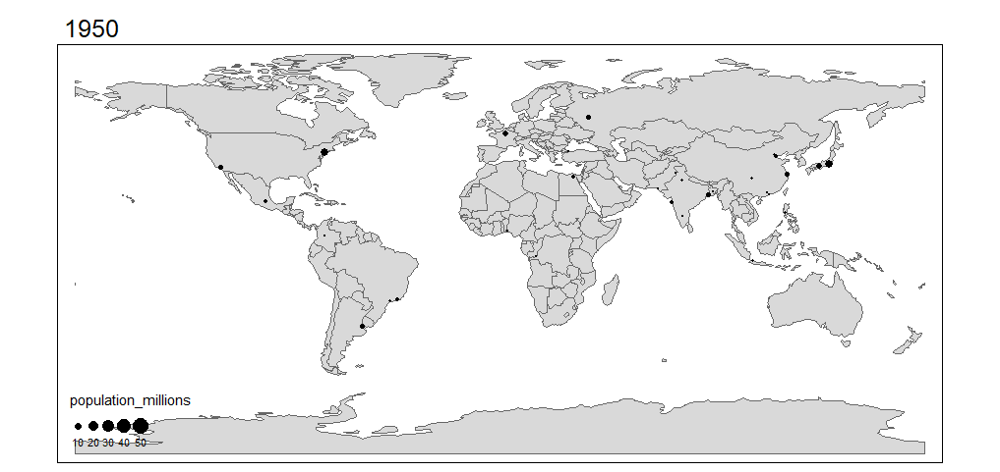
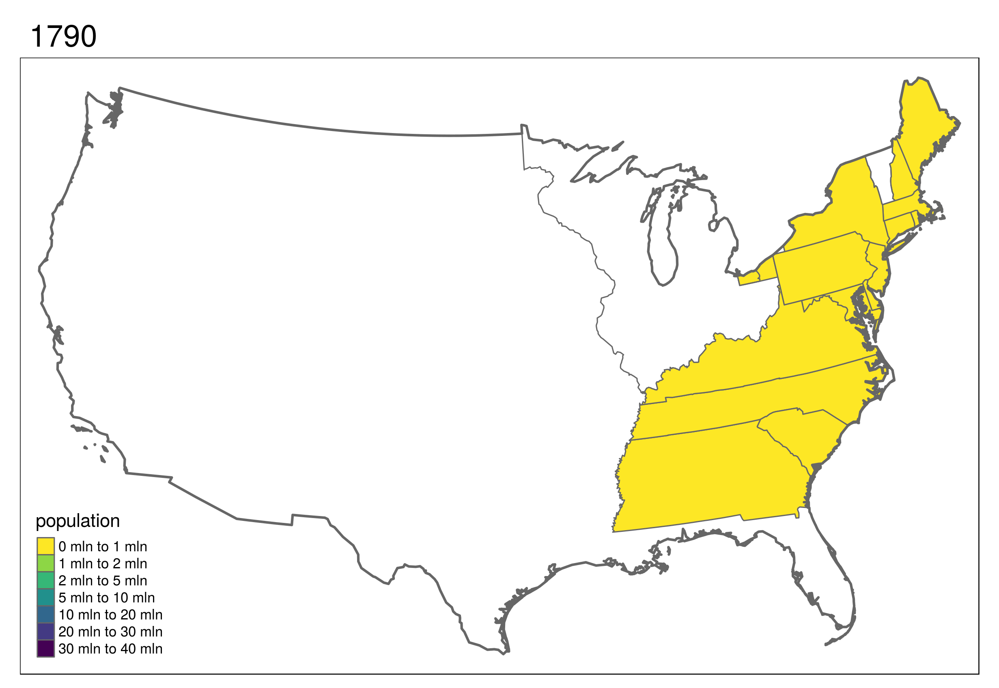
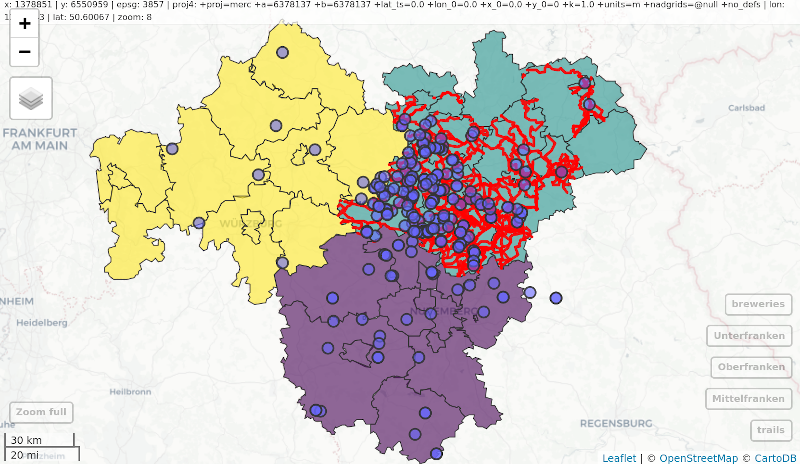
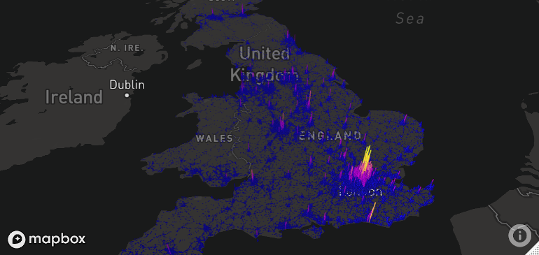

# Making maps with R

**Learning objectives:**

* Explore tools that help analysts produce maps with `R` packages
* Discuss motivation for using the various technologies
* Introduce some spatial calculations

```{r ch9_setup, echo = TRUE, message = FALSE, warning = FALSE}
library(colorspace)
library(dplyr)
library(ggplot2) # tidyverse data visualization package
library(grid)
library(leaflet) # for interactive maps
# library(mapdeck)
library(mapview)
library(sf)
library(spData)
library(spDataLarge)
library(terra)
library(tmap)    # for static and interactive maps

sessionInfo()
```

## Space and Time

### Historical


Ptolemy’s world map in his masterpiece *Geography* (reproduction shown above, [Wikipedia](https://en.wikipedia.org/wiki/Ptolemy%27s_world_map)) 

### Base R

```{r}
us_states2163 = st_transform(us_states, "EPSG:2163") # from chapter 5
plot(us_states2163)
```

### Science Communication



> "...poor map making can hinder the communication of results (Brewer 2015)"

Brewer is also renowned for the Color Brewer ideas ([faculty website](https://www.personal.psu.edu/cab38/))

### Ease of Use

While software such as ArcGIS or QGIS may be preferred by professional analysts, R packages such as `tmap` are easier for introductory endeavors 

* accessible
* citizen science

## tmap Basics

`tmap` is a powerful and flexible map-making package with sensible defaults. It has a concise syntax that allows for the creation of attractive maps with minimal code which will be familiar to `ggplot2` users.

* Vignette: [Getting Started](https://cran.r-project.org/web/packages/tmap/vignettes/tmap-getstarted.html)
* Maintainer/Creator: [Martijn Tennekes](https://www.jstatsoft.org/article/view/v084i06)

```{r, eval = FALSE}
# tmap can be applied to simples features data
tm_shape(nz)
# at this moment, code produces error: "no layer elements defined after tm_shape"
```

```{r}
# Add fill layer to nz shape
tm_shape(nz) +
  tm_fill() 
```

```{r}
# Add border layer to nz shape
tm_shape(nz) +
  tm_borders()
```

```{r}
# Add fill and border layers to nz shape
tm_shape(nz) +
  tm_fill() +
  tm_borders() 
```

`tm_*()` layers include

* fill
* borders
* bubbles
* text
* raster

```{r}
# Bubbles?
tm_shape(nz) +
  tm_bubbles()
```

More information can be found with `help("tmap-element")`

### Quick Thematic Maps

```{r}
# wrapper
qtm(nz) # tm_shape(nz) + tm_fill() + tm_borders()
```

```{r}
qtm(nz) +
  qtm(nz_height) 
```


## Map Objects

```{r}
# tm_polygons() == tm_fill() + tm_borders()
map_nz = tm_shape(nz) + tm_polygons()
class(map_nz)
```

### Layers

```{r}
map_nz1 = map_nz +
  tm_shape(nz_elev) + tm_raster(alpha = 0.7)
map_nz1
```

### Pipeline

```{r}
nz_water = st_union(nz) |> st_buffer(22200) |> 
  st_cast(to = "LINESTRING")
map_nz2 = map_nz1 +
  tm_shape(nz_water) + tm_lines()
map_nz2
```

### Arrange

```{r}
map_nz3 = map_nz2 +
  tm_shape(nz_height) + tm_dots()

tmap_arrange(map_nz1, map_nz2, map_nz3)
```

## Aesthetics

```{r}
ma1 = tm_shape(nz) + tm_fill(col = "red")
ma2 = tm_shape(nz) + tm_fill(col = "red", alpha = 0.3)
ma3 = tm_shape(nz) + tm_borders(col = "blue")
ma4 = tm_shape(nz) + tm_borders(lwd = 3)
ma5 = tm_shape(nz) + tm_borders(lty = 2)
ma6 = tm_shape(nz) + tm_fill(col = "red", alpha = 0.3) +
  tm_borders(col = "blue", lwd = 3, lty = 2)
tmap_arrange(ma1, ma2, ma3, ma4, ma5, ma6)
```


## Colors

```{r, message = FALSE, warning = FALSE}
color_map1 <- tm_shape(nz) + tm_polygons(col = "Median_income")
breaks = c(0, 3, 4, 5) * 10000
color_map2 <- tm_shape(nz) + 
  tm_polygons(col = "Median_income", breaks = breaks)
color_map3 <- tm_shape(nz) + 
  tm_polygons(col = "Median_income", n = 10)
color_map4 <- tm_shape(nz) + 
  tm_polygons(col = "Median_income", palette = "BuGn")
tmap_arrange(color_map1, color_map2, color_map3, color_map4)
```

### Breaks

```{r, message = FALSE, warning = FALSE}
breaks_map1 <- tm_shape(nz) + 
  tm_polygons(col = "Median_income", style = "pretty")
breaks_map2 <- tm_shape(nz) + 
  tm_polygons(col = "Median_income", style = "equal")
breaks_map3 <- tm_shape(nz) + 
  tm_polygons(col = "Median_income", style = "quantile")
breaks_map4 <- tm_shape(nz) + 
  tm_polygons(col = "Median_income", style = "jenks")
breaks_map5 <- tm_shape(nz) + 
  tm_polygons(col = "Median_income", style = "cont")
breaks_map6 <- tm_shape(nz) + 
  tm_polygons(col = "Island", style = "cat")
tmap_arrange(breaks_map1, breaks_map2, breaks_map3)
tmap_arrange(breaks_map4, breaks_map5, breaks_map6)
```

<details><summary>Further details</summary>

* `style = "pretty"`, the default setting, rounds breaks into whole numbers where possible and spaces them evenly;
* `style = "equal"` divides input values into bins of equal range and is appropriate for variables with a uniform distribution (not recommended for variables with a skewed distribution as the resulting map may end-up having little color diversity);
* `style = "quantile"` ensures the same number of observations fall into each category (with the potential downside that bin ranges can vary widely);
* `style = "jenks"` identifies groups of similar values in the data and maximizes the differences between categories;
* `style = "cont"` (and "order") present a large number of colors over continuous color fields and are particularly suited for continuous rasters ("order" can help visualize skewed distributions);
* `style = "cat"` was designed to represent categorical values and assures that each category receives a unique color

</details>

### Palettes

```{r, message = FALSE, warning = FALSE}
# categorical
tm_shape(nz) + 
  tm_polygons(col = "Island", style = "cat")
```

```{r, message = FALSE, warning = FALSE}
# sequential
tm_shape(nz) + tm_polygons("Population", palette = "Blues")
```

```{r, message = FALSE, warning = FALSE}
# diverging
tm_shape(nz) + 
  tm_polygons(col = "Median_income", 
              palette = colorspace::diverging_hcl(5, "Green_Brown"),
              style = "jenks")
# https://colorspace.r-forge.r-project.org/articles/colorspace.html
```


## Elements

### Compass and Scale Bar

```{r, message = FALSE, warning = FALSE}
map_nz + 
  tm_compass(type = "8star", position = c("left", "top")) +
  tm_scale_bar(breaks = c(0, 100, 200), text.size = 1)
```

### Settings

```{r, message = FALSE, warning = FALSE}
misc_map1 <- map_nz + tm_layout(title = "New Zealand")
misc_map2 <- map_nz + tm_layout(scale = 5)
misc_map3 <- map_nz + tm_layout(bg.color = "lightblue")
misc_map4 <- map_nz + tm_layout(frame = FALSE)

tmap_arrange(misc_map1, misc_map2, misc_map3, misc_map4)
```

<details><summary>Other arguments</summary>

* Frame width (`frame.lwd`) and an option to allow double lines (`frame.double.line`)
* Margin settings including `outer.margin` and `inner.margin`
* Font settings controlled by `fontface` and `fontfamily`
* Legend settings including binary options such as `legend.show` (whether or not to show the legend), `legend.only` (omit the map), and `legend.outside` (should the legend go outside the map?), as well as multiple choice settings such as `legend.position`
* Default colors of aesthetic layers (`aes.color`), map attributes such as the frame (`attr.color`)
* Color settings controlling `sepia.intensity` (how yellowy the map looks) and saturation (a color-grayscale)

</details>

### Themes

```{r, message = FALSE, warning = FALSE}
theme_example_1 <- map_nz + tm_style("bw")
theme_example_2 <- map_nz + tm_style("classic")
theme_example_3 <- map_nz + tm_style("cobalt")
theme_example_4 <- map_nz + tm_style("col_blind")

tmap_arrange(theme_example_1, theme_example_2, 
             theme_example_3, theme_example_4)
```

* Additional resource: [How do you position the title and legend in tmap?](https://stackoverflow.com/questions/60892033/how-do-you-position-the-title-and-legend-in-tmap) at Stack Overflow

## Inset Maps

```{r, message = FALSE, warning = FALSE}
map_nz3
```

An area of interest may be difficult to see at first.

```{r, message = FALSE, warning = FALSE}
# define area of interest
nz_region = st_bbox(c(xmin = 1340000, xmax = 1450000,
                      ymin = 5130000, ymax = 5210000),
                    crs = st_crs(nz_height)) |> 
  st_as_sfc()

# create inset map
nz_height_map = tm_shape(nz_elev, bbox = nz_region) +
  tm_raster(style = "cont", palette = "YlGn", legend.show = TRUE) +
  tm_shape(nz_height) + tm_symbols(shape = 2, col = "red", size = 1) +
  tm_scale_bar(position = c("left", "bottom"))

# create basemap
nz_map = tm_shape(nz) + tm_polygons() +
  tm_shape(nz_height) + tm_symbols(shape = 2, col = "red", size = 0.1) + 
  tm_shape(nz_region) + tm_borders(lwd = 3)

# display result
nz_height_map
print(nz_map, vp = viewport(0.8, 0.27, width = 0.5, height = 0.5))
```

Here is another example with the United States

```{r, message = FALSE, warning = FALSE}
us_states_map = tm_shape(us_states, projection = "EPSG:2163") + tm_polygons() + 
  tm_layout(frame = FALSE)

hawaii_map = tm_shape(hawaii) + tm_polygons() + 
  tm_layout(title = "Hawaii", frame = FALSE, bg.color = NA, 
            title.position = c("LEFT", "BOTTOM"))
alaska_map = tm_shape(alaska) + tm_polygons() + 
  tm_layout(title = "Alaska", frame = FALSE, bg.color = NA)

us_states_map
print(hawaii_map, vp = grid::viewport(0.35, 0.1, width = 0.2, height = 0.1))
print(alaska_map, vp = grid::viewport(0.15, 0.15, width = 0.3, height = 0.3))
```


## Facets

Facets, also referred to as *small multiples*, enable the visualization of how spatial relationships change with respect to another variable, such as time.

```{r, message = FALSE, warning = FALSE}
urb_1970_2030 = urban_agglomerations |> 
  filter(year %in% c(1970, 1990, 2010, 2030))

tm_shape(world) +
  tm_polygons() +
  tm_shape(urb_1970_2030) +
  tm_symbols(col = "black", border.col = "white", size = "population_millions") +
  tm_facets(by = "year", nrow = 2, free.coords = FALSE) +
  tm_layout(legend.outside = TRUE,
            legend.outside.position = "bottom")
```


## Animated Maps

```{r, eval = FALSE}
# create animation
urb_anim = tm_shape(world) + tm_polygons() + 
  tm_shape(urban_agglomerations) + tm_dots(size = "population_millions") +
  tm_facets(along = "year", #the main change
            free.coords = FALSE) #still important

# save animation file
tmap_animation(urb_anim, 
               filename = "urb_anim.gif", 
               delay = 25)
```






## Interactive Maps

```{r}
tmap_mode("view") # or use tmap_leaflet()
map_nz3
```

```{r}
map_nz + tm_basemap(server = "OpenTopoMap")
```

```{r}
world_coffee = left_join(world, coffee_data, by = "name_long")
facets = c("coffee_production_2016", "coffee_production_2017")
tm_shape(world_coffee) + tm_polygons(facets) + 
  tm_facets(nrow = 1, sync = TRUE)
```

```{r}
# restore static plot default
tmap_mode("plot")
```

### Mapview

```{r}
mapview::mapview(nz)
```

Consider the following example where `sf` is used to intersect lines and polygons and then is visualized with `mapview`

```{r, echo = FALSE, eval = FALSE}
# ERROR?
oberfranken = subset(franconia, district == "Oberfranken")
trails |>
  st_transform(st_crs(oberfranken)) |>
  st_intersection(oberfranken) |>
  st_collection_extract("LINESTRING") |>
  mapview(color = "red", lwd = 3, layer.name = "trails") +
  mapview(franconia, zcol = "district", burst = TRUE) +
  breweries
```



### Mapdeck

A unique feature of mapdeck is its provision of interactive '2.5d' perspectives



### Leaflet

`leaflet` which is the most mature and widely used interactive mapping package in R. `leaflet` provides a relatively low-level interface to the Leaflet JavaScript library. Here is the `leaflet` package in action, showing cycle hire points in London.

```{r, eval = FALSE}
pal = colorNumeric("RdYlBu", domain = cycle_hire$nbikes)
leaflet(data = cycle_hire) |> 
  addProviderTiles(providers$CartoDB.Positron) |>
  addCircles(col = ~pal(nbikes), opacity = 0.9) |> 
  addPolygons(data = lnd, fill = FALSE) |> 
  addLegend(pal = pal, values = ~nbikes) |> 
  setView(lng = -0.1, 51.5, zoom = 12) |> 
  addMiniMap()
```

<div class="figure" style="text-align: center">
<span style="display:block;" id="fig:leaflet_example"></span>
<iframe src="https://geocompr.github.io/img/leaflet.html" data-external="1" width="690" height="400px">
</iframe>
<p class="caption">
FIGURE 9.23: The leaflet package in action, showing cycle hire points in London.
</p>
</div>


## Shiny

The web mapping approach to interactivity has limitations:

* Although the map is interactive in terms of panning, zooming and clicking, the code is static, meaning the user interface is fixed
* All map content is generally static in a web map, meaning that web maps cannot scale to handle large datasets easily
* Additional layers of interactivity, such a graphs showing relationships between variables and *dashboards* are difficult to create using the web-mapping approach

<div class="figure" style="text-align: center">
<span style="display:block;" id="fig:CycleHireApp-html"></span>
<iframe src="https://shiny.robinlovelace.net/CycleHireApp/?showcase=0" data-external="1" width="690" height="400px">
</iframe>
<p class="caption">
FIGURE 9.25: CycleHireApp, a simple web mapping application for finding the closest cycle hiring station based on your location and requirement of cycles. Interactive version available online at r.geocompx.org.
</p>
</div>

Cycle Hire App by Robin Lovelace ([R code](https://github.com/geocompx/geocompr/blob/main/apps/CycleHireApp/app.R))

Additional Resource: [Geospatial Health Data: Modeling and Visualization with R-INLA and Shiny](https://www.paulamoraga.com/book-geospatial/sec-shinyexample.html) by Paula Moraga


## Other Mapping Packages


<div class="inline-table"><table class="table table-sm">
<caption>
<span id="tab:map-gpkg">TABLE 9.1: </span>Selected general-purpose mapping packages.
</caption>
<thead><tr>
<th style="text-align:left;">
Package
</th>
<th style="text-align:left;">
Title
</th>
</tr></thead>
<tbody>
<tr>
<td style="text-align:left;">
ggplot2
</td>
<td style="text-align:left;width: 9cm; ">
Create Elegant Data Visualisations Using the Grammar of Graphics
</td>
</tr>
<tr>
<td style="text-align:left;">
googleway
</td>
<td style="text-align:left;width: 9cm; ">
Accesses Google Maps APIs to Retrieve Data and Plot Maps
</td>
</tr>
<tr>
<td style="text-align:left;">
ggspatial
</td>
<td style="text-align:left;width: 9cm; ">
Spatial Data Framework for ggplot2
</td>
</tr>
<tr>
<td style="text-align:left;">
leaflet
</td>
<td style="text-align:left;width: 9cm; ">
Create Interactive Web Maps with Leaflet
</td>
</tr>
<tr>
<td style="text-align:left;">
mapview
</td>
<td style="text-align:left;width: 9cm; ">
Interactive Viewing of Spatial Data in R
</td>
</tr>
<tr>
<td style="text-align:left;">
plotly
</td>
<td style="text-align:left;width: 9cm; ">
Create Interactive Web Graphics via ‘plotly.js’
</td>
</tr>
<tr>
<td style="text-align:left;">
rasterVis
</td>
<td style="text-align:left;width: 9cm; ">
Visualization Methods for Raster Data
</td>
</tr>
<tr>
<td style="text-align:left;">
tmap
</td>
<td style="text-align:left;width: 9cm; ">
Thematic Maps
</td>
</tr>
</tbody>
</table></div>

### Specific Map Types

<div class="inline-table"><table class="table table-sm">
<caption>
<span id="tab:map-spkg">TABLE 9.2: </span>Selected specific-purpose mapping packages, with associated metrics.
</caption>
<thead><tr>
<th style="text-align:left;">
Package
</th>
<th style="text-align:left;">
Title
</th>
</tr></thead>
<tbody>
<tr>
<td style="text-align:left;">
cartogram
</td>
<td style="text-align:left;">
Create Cartograms with R
</td>
</tr>
<tr>
<td style="text-align:left;">
geogrid
</td>
<td style="text-align:left;">
Turn Geospatial Polygons into Regular or Hexagonal Grids
</td>
</tr>
<tr>
<td style="text-align:left;">
geofacet
</td>
<td style="text-align:left;">
‘ggplot2’ Faceting Utilities for Geographical Data
</td>
</tr>
<tr>
<td style="text-align:left;">
linemap
</td>
<td style="text-align:left;">
Line Maps
</td>
</tr>
<tr>
<td style="text-align:left;">
rayshader
</td>
<td style="text-align:left;">
Create Maps and Visualize Data in 2D and 3D
</td>
</tr>
</tbody>
</table></div>

## Meeting Videos

### Cohort 1

`r knitr::include_url("https://www.youtube.com/embed/fTv0vKC3vLU")`

<details>
<summary> Meeting chat log </summary>

```
00:26:24	Olivier Leroy:	New Zealand Dollar
00:40:36	Jim Gruman:	shift_geometry() in tigris
00:40:45	Olivier Leroy:	Reacted to "shift_geometry() in ..." with 👍
00:40:48	Jim Gruman:	according to Kyle Walker
00:41:53	Olivier Leroy:	I used it (it works 🙂 ) I thinks jt reproject Alaska and Hawaii then move them while trap do an inset map
00:57:39	Olivier Leroy:	https://www.paulamoraga.com/tutorial-maps/
01:01:32	Ryan:	Great topics. Thank you.
```
</details>
