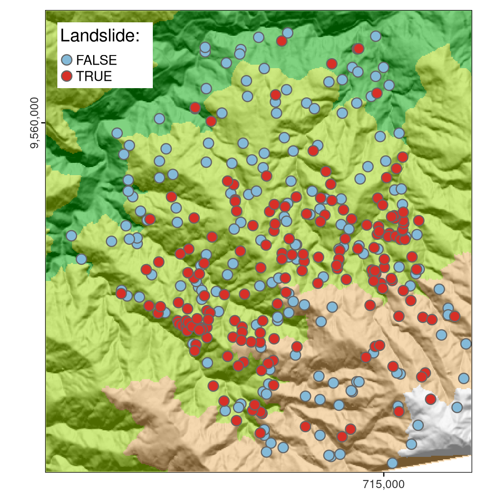
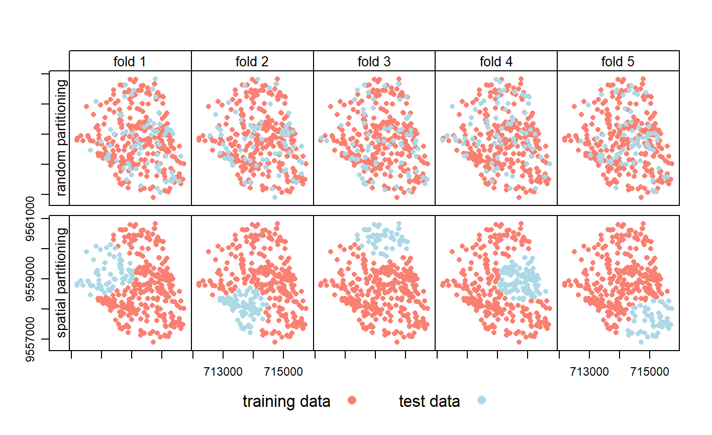
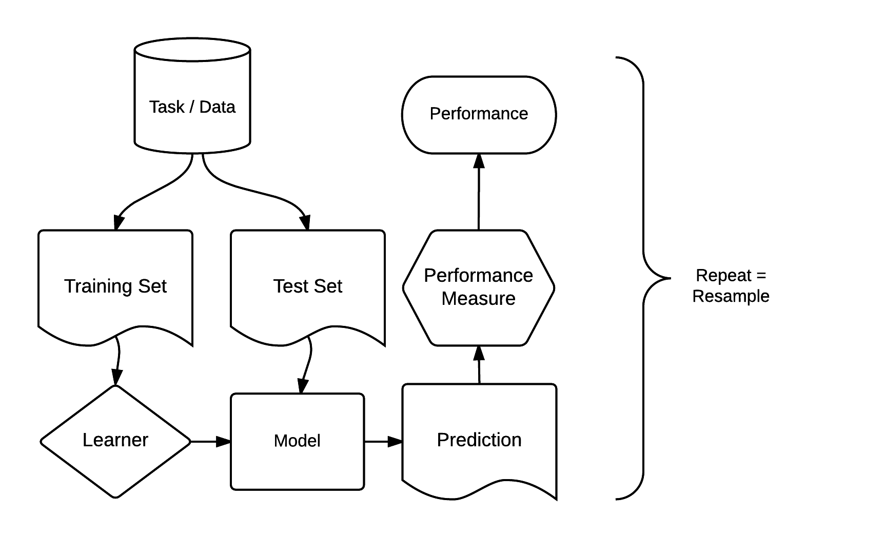
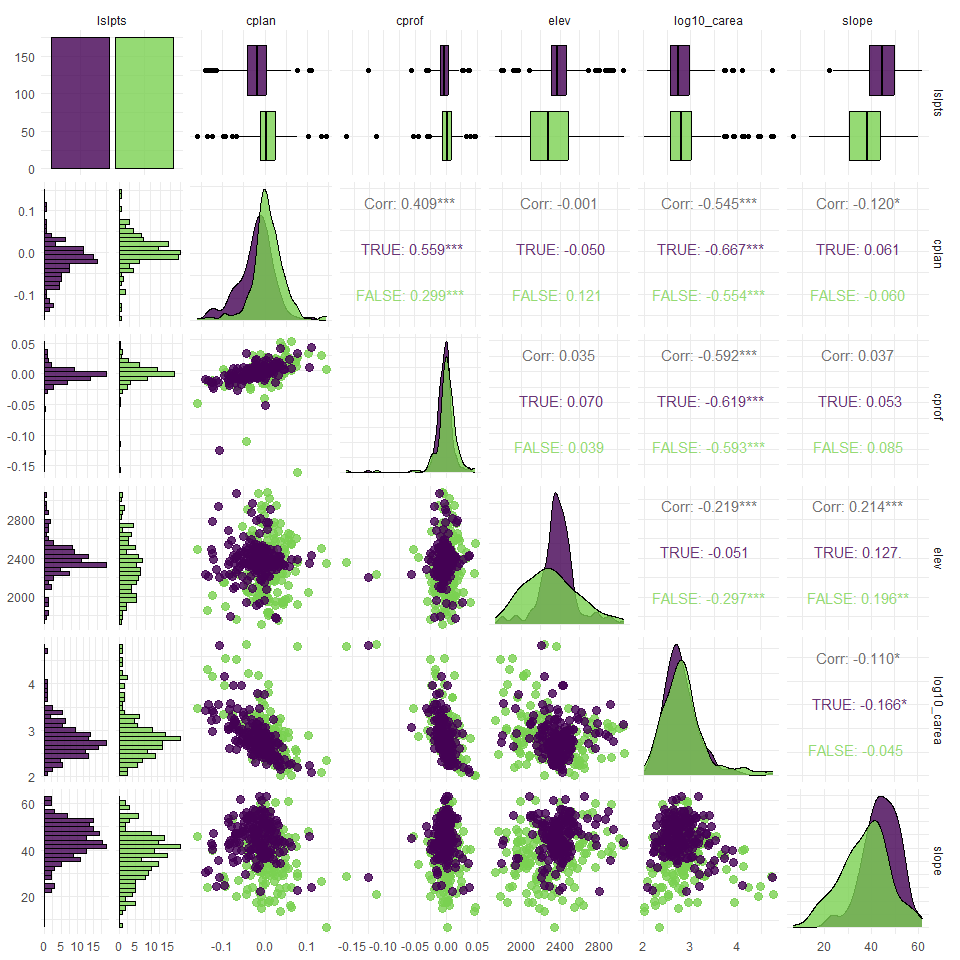
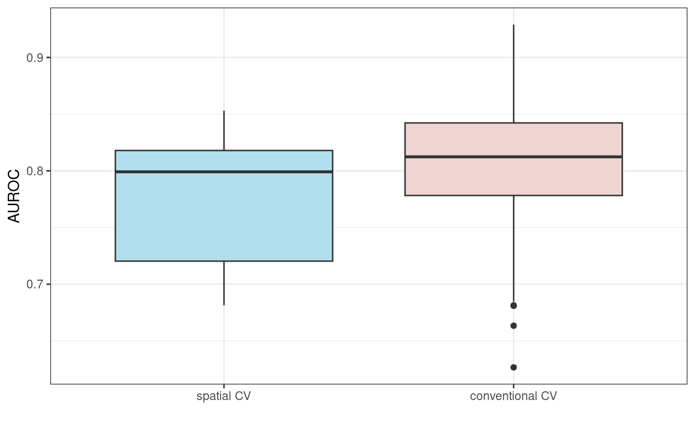

# Statistical Learning

* **Statistical modeling** is a formalization of relationships between variables in the data in the form of mathematical equations.

    - Statistics is about the sample, population, hypothesis, etc.
    
* **Machine Learning** is an algorithm that can learn from data without relying on rules-based programming.

    - Machine learning is all about *predictions*, supervised learning, unsupervised learning, etc.
    
[(source: Kaggle forum)](https://www.kaggle.com/questions-and-answers/198927)

* Resource: [CRAN Task View for Machine Learning and Statistical Learning](https://cran.r-project.org/web/views/MachineLearning.html)


## Terminology

* **supervised** and **unsupervised** techniques

    - supervised where there is training data
    - unsupervised techniques such as clustering
    
* **response variables** can be binary, categorical, integer, or otherwise numeric

* **predictive performance** will be assessed using spatial cross-validation

    - CV helps to detect overfitting
    - *caution:* due to spatial autocorrelation, training and test datasets would not be independent, so **spatial CV**

### Code Packages

```{r}
library("dplyr")
library("future")
library("ggplot2")
library("lgr")
library("mlr3")
library("mlr3learners")
# library(mlr3extralearners) #not available for R 4.3.0??
library("mlr3spatiotempcv")
library("mlr3tuning")
library("mlr3viz")
library("pROC")
library("progressr")
library("sf")
library("terra")
```

```{r}
sessionInfo()
```


## Case Study: Landslide Susceptibility


This case study is based on a dataset of landslide locations in Southern Ecuador and described in detail in Muenchow, Brenning, and Richter (2012)

```{r}
data("lsl", "study_mask", package = "spDataLarge")
ta = terra::rast(system.file("raster/ta.tif", package = "spDataLarge"))
```

```{r}
str(lsl, give.attr = FALSE)
```
```{r}
study_mask
```
```{r}
ta
```

### Response Variable



### Predictor Variables

* `slope`: slope angle ($^\circ$)
* `cplan`: plan curvature (rad $m^{−1}$) expressing the convergence or divergence of a slope and thus water flow
* `cprof`: profile curvature (rad $m^{−1}$) as a measure of flow acceleration, also known as downslope change in slope angle
* `elev`: elevation m.a.s.l. (mean above sea level) as the representation of different altitudinal zones of vegetation and precipitation in the study area
* `log10_carea`: the decadic logarithm of the catchment area ($\log_{10} m^{2}$) representing the amount of water flowing towards a location


## Supervised Learning

We fit a logistic regression model through the generalized linear models tools.

```{r}
glm_fit = glm(lslpts ~ slope + cplan + cprof + elev + log10_carea,
          family = binomial(), #logistic regression
          data = lsl)

summary(glm_fit)
```

Next, we can predict various levels of landslide susceptibility

```{r}
glm_pred = predict(object = glm_fit, type = "response")
summary(glm_pred)
```

Here, we visualize the predictions

```{r}
glm_pred_rast = terra::predict(ta, model = glm_fit, type = "response")
plot(glm_pred_rast)
```

### AUROC

The most popular measure to assess the predictive performance of a binomial model is the **Area Under the Receiver Operator Characteristic Curve** (AUROC). This is a value between 0.5 and 1.0, with 0.5 indicating a model that is no better than random and 1.0 indicating perfect prediction of the two classes. Thus, the higher the AUROC, the better the model’s predictive power.

```{r, message = FALSE, warning = FALSE}
pROC::auc(pROC::roc(lsl$lslpts, fitted(glm_fit)))
```

## Spatial Cross-Validation

* **Cross-validation** belongs to the family of resampling methods (James et al. 2013). 

    - idea is to *split* (repeatedly) a dataset into training and test sets whereby the training data is used to fit a model which then is applied to the test set. 
    - Comparing the predicted values with the known response values from the test set (using a performance measure such as the AUROC in the binomial case) gives a *bias-reduced assessment* of the model’s capability to generalize the learned relationship to independent data.



* This means these [geographic data] points are not statistically independent because training and test points in conventional CV are often too close to each other

    - To alleviate this problem ‘spatial partitioning’ is used to split the observations into spatially disjointed subsets (using the observations’ coordinates in a k-means clustering; Brenning (2012b)


## mlr3

The mlr3 package and ecosystem was developed to address these issues. It acts as a ‘meta-package’, providing a unified interface to popular supervised and unsupervised statistical learning techniques including classification, regression, survival analysis and clustering (Lang et al. 2019; Becker et al. 2022)




## GLM

```{r}
# create spatial classification task
task = mlr3spatiotempcv::TaskClassifST$new(
  id = "ecuador_lsl",
  backend = mlr3::as_data_backend(lsl), # expects response and predictor vars
  target = "lslpts", 
  positive = "TRUE",
  coordinate_names = c("x", "y"),
  coords_as_features = FALSE,
  crs = "EPSG:32717"
  )
```

```{r}
# plot response against each predictor
mlr3viz::autoplot(task, type = "duo")
```

```{r, eval = FALSE, message = FALSE, warning = FALSE}
# plot all variables against each other (slightly long computation time)
mlr3viz::autoplot(task, type = "pairs")
```



* The `mlr3extralearners` package contains more information (but `mlr3extralearners` was not currently available for `R 4.3.0`)

<table style="border-collapse:collapse;border-spacing:0" class="tg"><thead><tr><th style="border-color:black;border-style:solid;border-width:1px;font-family:Arial, sans-serif;font-size:14px;font-weight:bold;overflow:hidden;padding:10px 5px;text-align:center;vertical-align:middle;word-break:normal">Class </th><th style="border-color:black;border-style:solid;border-width:1px;font-family:Arial, sans-serif;font-size:14px;font-weight:bold;overflow:hidden;padding:10px 5px;text-align:center;vertical-align:middle;word-break:normal"> Name </th><th style="border-color:black;border-style:solid;border-width:1px;font-family:Arial, sans-serif;font-size:14px;font-weight:bold;overflow:hidden;padding:10px 5px;text-align:center;vertical-align:middle;word-break:normal"> Short name </th><th style="border-color:black;border-style:solid;border-width:1px;font-family:Arial, sans-serif;font-size:14px;font-weight:bold;overflow:hidden;padding:10px 5px;text-align:center;vertical-align:middle;word-break:normal"> Package </th></tr></thead><tbody><tr><td style="border-color:black;border-style:solid;border-width:1px;font-family:Arial, sans-serif;font-size:14px;overflow:hidden;padding:10px 5px;text-align:center;vertical-align:middle;word-break:normal"> classif.adaboostm1 </td><td style="border-color:black;border-style:solid;border-width:1px;font-family:Arial, sans-serif;font-size:14px;overflow:hidden;padding:10px 5px;text-align:center;vertical-align:middle;word-break:normal"> ada Boosting M1 </td><td style="border-color:black;border-style:solid;border-width:1px;font-family:Arial, sans-serif;font-size:14px;overflow:hidden;padding:10px 5px;text-align:center;vertical-align:middle;word-break:normal"> adaboostm1 </td><td style="border-color:black;border-style:solid;border-width:1px;font-family:Arial, sans-serif;font-size:14px;overflow:hidden;padding:10px 5px;text-align:center;vertical-align:middle;word-break:normal"> RWeka </td></tr><tr><td style="border-color:black;border-style:solid;border-width:1px;font-family:Arial, sans-serif;font-size:14px;overflow:hidden;padding:10px 5px;text-align:center;vertical-align:middle;word-break:normal"> classif.binomial </td><td style="border-color:black;border-style:solid;border-width:1px;font-family:Arial, sans-serif;font-size:14px;overflow:hidden;padding:10px 5px;text-align:center;vertical-align:middle;word-break:normal"> Binomial Regression </td><td style="border-color:black;border-style:solid;border-width:1px;font-family:Arial, sans-serif;font-size:14px;overflow:hidden;padding:10px 5px;text-align:center;vertical-align:middle;word-break:normal"> binomial </td><td style="border-color:black;border-style:solid;border-width:1px;font-family:Arial, sans-serif;font-size:14px;overflow:hidden;padding:10px 5px;text-align:center;vertical-align:middle;word-break:normal"> stats </td></tr><tr><td style="border-color:black;border-style:solid;border-width:1px;font-family:Arial, sans-serif;font-size:14px;overflow:hidden;padding:10px 5px;text-align:center;vertical-align:middle;word-break:normal"> classif.featureless </td><td style="border-color:black;border-style:solid;border-width:1px;font-family:Arial, sans-serif;font-size:14px;overflow:hidden;padding:10px 5px;text-align:center;vertical-align:middle;word-break:normal"> Featureless classifier </td><td style="border-color:black;border-style:solid;border-width:1px;font-family:Arial, sans-serif;font-size:14px;overflow:hidden;padding:10px 5px;text-align:center;vertical-align:middle;word-break:normal"> featureless </td><td style="border-color:black;border-style:solid;border-width:1px;font-family:Arial, sans-serif;font-size:14px;overflow:hidden;padding:10px 5px;text-align:center;vertical-align:middle;word-break:normal"> mlr </td></tr><tr><td style="border-color:black;border-style:solid;border-width:1px;font-family:Arial, sans-serif;font-size:14px;overflow:hidden;padding:10px 5px;text-align:center;vertical-align:middle;word-break:normal"> classif.fnn </td><td style="border-color:black;border-style:solid;border-width:1px;font-family:Arial, sans-serif;font-size:14px;overflow:hidden;padding:10px 5px;text-align:center;vertical-align:middle;word-break:normal"> Fast k-Nearest Neighbour </td><td style="border-color:black;border-style:solid;border-width:1px;font-family:Arial, sans-serif;font-size:14px;overflow:hidden;padding:10px 5px;text-align:center;vertical-align:middle;word-break:normal"> fnn </td><td style="border-color:black;border-style:solid;border-width:1px;font-family:Arial, sans-serif;font-size:14px;overflow:hidden;padding:10px 5px;text-align:center;vertical-align:middle;word-break:normal"> FNN </td></tr><tr><td style="border-color:black;border-style:solid;border-width:1px;font-family:Arial, sans-serif;font-size:14px;overflow:hidden;padding:10px 5px;text-align:center;vertical-align:middle;word-break:normal"> classif.gausspr </td><td style="border-color:black;border-style:solid;border-width:1px;font-family:Arial, sans-serif;font-size:14px;overflow:hidden;padding:10px 5px;text-align:center;vertical-align:middle;word-break:normal"> Gaussian Processes </td><td style="border-color:black;border-style:solid;border-width:1px;font-family:Arial, sans-serif;font-size:14px;overflow:hidden;padding:10px 5px;text-align:center;vertical-align:middle;word-break:normal"> gausspr </td><td style="border-color:black;border-style:solid;border-width:1px;font-family:Arial, sans-serif;font-size:14px;overflow:hidden;padding:10px 5px;text-align:center;vertical-align:middle;word-break:normal"> kernlab </td></tr><tr><td style="border-color:black;border-style:solid;border-width:1px;font-family:Arial, sans-serif;font-size:14px;overflow:hidden;padding:10px 5px;text-align:center;vertical-align:middle;word-break:normal"> classif.IBk </td><td style="border-color:black;border-style:solid;border-width:1px;font-family:Arial, sans-serif;font-size:14px;overflow:hidden;padding:10px 5px;text-align:center;vertical-align:middle;word-break:normal"> k-Nearest Neighbours </td><td style="border-color:black;border-style:solid;border-width:1px;font-family:Arial, sans-serif;font-size:14px;overflow:hidden;padding:10px 5px;text-align:center;vertical-align:middle;word-break:normal"> ibk </td><td style="border-color:black;border-style:solid;border-width:1px;font-family:Arial, sans-serif;font-size:14px;overflow:hidden;padding:10px 5px;text-align:center;vertical-align:middle;word-break:normal"> RWeka </td></tr></tbody></table>

```{r}
learner = mlr3::lrn("classif.log_reg", predict_type = "prob")
# learner$help()
```


## Spatial Resampling

```{r}
resampling = mlr3::rsmp("repeated_spcv_coords", folds = 5, repeats = 100)
```

```{r, cache = TRUE, eval = FALSE}
# approx 15 seconds of run time
# reduce verbosity
lgr::get_logger("mlr3")$set_threshold("warn")
# run spatial cross-validation and save it to resample result glm (rr_glm)
rr_spcv_glm = mlr3::resample(task = task,
                             learner = learner,
                             resampling = resampling)
# compute the AUROC as a data.table
score_spcv_glm = rr_spcv_glm$score(measure = mlr3::msr("classif.auc"))
# keep only the columns you need
score_spcv_glm = score_spcv_glm[, .(task_id, learner_id, resampling_id, 
                                    classif.auc)]
```

```{r}
# loading the textbook data directly to save computation time
score = readRDS("extdata/12-bmr_score.rds")
score_spcv_glm = score[learner_id == "classif.log_reg" & 
                         resampling_id == "repeated_spcv_coords"]
```

```{r}
# average AUROC
mean(score_spcv_glm$classif.auc) |> round(2)
```



## SVM

Random forest models might be more popular than SVMs [support vector machines]; however, the positive effect of tuning hyperparameters on model performance is much more pronounced in the case of SVMs (Probst, Wright, and Boulesteix 2018)

* `ksvm` from the **kernlab** package (which allows for hyperparameters to be tuned automatically)
* `C-svc`: support vector classifier for classification task

```{r}
# ERROR?  "Element with key 'classif.ksvm' not found in DictionaryLearner!"
# lrn_ksvm = mlr3::lrn("classif.ksvm", predict_type = "prob", kernel = "rbfdot", type = "C-svc")
lrn_svm = mlr3::lrn("classif.svm", predict_type = "prob", kernel = "radial",
                     type = "C-classification")
lrn_svm$fallback = lrn("classif.featureless", predict_type = "prob")
perf_level = mlr3::rsmp("repeated_spcv_coords", folds = 5, repeats = 100)
```

## Tuning

The next step is new, however: to tune the hyperparameters. Using the same data for the performance assessment and the tuning would potentially lead to overoptimistic results (Cawley and Talbot 2010). This can be avoided using nested spatial CV.  [Figure was taken from Schratz et al. (2019)]


```{r}
# five spatially disjoint partitions
tune_level = mlr3::rsmp("spcv_coords", folds = 5)
# use 50 randomly selected hyperparameters
terminator = mlr3tuning::trm("evals", n_evals = 50)
tuner = mlr3tuning::tnr("random_search")
# define the outer limits of the randomly selected hyperparameters
search_space = paradox::ps(
  C = paradox::p_dbl(lower = -12, upper = 15, trafo = function(x) 2^x),
  sigma = paradox::p_dbl(lower = -15, upper = 6, trafo = function(x) 2^x)
)
```

```{r}
at_ksvm = mlr3tuning::AutoTuner$new(
  learner = lrn_svm,
  resampling = tune_level,
  measure = mlr3::msr("classif.auc"),
  search_space = search_space,
  terminator = terminator,
  tuner = tuner
)
```

<details>
<summary>Accounting</summary>

The tuning is now set-up to fit 250 models to determine optimal hyperparameters for one fold. Repeating this for each fold, we end up with 1,250 (250 * 5) models for each repetition. Repeated 100 times means fitting a total of 125,000 models to identify optimal hyperparameters (Figure 12.3). These are used in the performance estimation, which requires the fitting of another 500 models (5 folds * 100 repetitions; see Figure 12.3). To make the performance estimation processing chain even clearer, let us write down the commands we have given to the computer:

1. Performance level (upper left part of Figure 12.6) - split the dataset into five spatially disjoint (outer) subfolds
2. Tuning level (lower left part of Figure 12.6) - use the first fold of the performance level and split it again spatially into five (inner) subfolds for the hyperparameter tuning. Use the 50 randomly selected hyperparameters in each of these inner subfolds, i.e., fit 250 models
3. Performance estimation - Use the best hyperparameter combination from the previous step (tuning level) and apply it to the first outer fold in the performance level to estimate the performance (AUROC)
4. Repeat steps 2 and 3 for the remaining four outer folds
5. Repeat steps 2 to 4, 100 times

The process of hyperparameter tuning and performance estimation is computationally intensive.

</details>

```{r}
# execute the outer loop sequentially and parallelize the inner loop
future::plan(list("sequential", "multisession"), 
             workers = floor(availableCores() / 2))
```

```{r, eval = FALSE}
# CAUTION: "It can easily run for half a day on a modern laptop."
progressr::with_progress(expr = {
  rr_spcv_svm = mlr3::resample(task = task,
                               learner = at_ksvm, 
                               # outer resampling (performance level)
                               resampling = perf_level,
                               store_models = FALSE,
                               encapsulate = "evaluate")
})

# stop parallelization
future:::ClusterRegistry("stop")
# compute the AUROC values
score_spcv_svm = rr_spcv_svm$score(measure = mlr3::msr("classif.auc")) 
# keep only the columns you need
score_spcv_svm = score_spcv_svm[, .(task_id, learner_id, resampling_id, classif.auc)]
```

```{r}
score = readRDS("extdata/12-bmr_score.rds")
score_spcv_svm = score[learner_id == "classif.ksvm.tuned" & 
                         resampling_id == "repeated_spcv_coords"]
# final mean AUROC
round(mean(score_spcv_svm$classif.auc), 2)
```


## Meeting Videos

### Cohort 1

`r knitr::include_url("https://www.youtube.com/embed/ozXzmWtv1_g")`

<details>
<summary> Meeting chat log </summary>
```
00:03:35	Olivier Leroy:	Turn off the mic as we put a kid to bed and he is not happy
00:04:05	Olivier Leroy:	Hurray! For completing the book!
00:04:55	Olivier Leroy:	I will ask if Robin or Jakub want to be here for one session
00:05:05	Olivier Leroy:	start
00:07:52	Olivier Leroy:	Way more 😛
00:09:08	Olivier Leroy:	It is an R package
00:09:29	Olivier Leroy:	https://www.rayshader.com/
00:14:13	Olivier Leroy:	`Type` is because  we do not want it in odd ratio no?
00:18:09	Olivier Leroy:	Mlr3 is way more present in Europe than tidymodel
00:18:18	Olivier Leroy:	Before it was all caret
00:18:52	Olivier Leroy:	(You also have it in tidymodel since last summer I think)
00:23:13	Olivier Leroy:	Slope and ctplan a bit
00:28:14	Olivier Leroy:	Was it because our previous model were overconfident ?
00:29:10	Olivier Leroy:	Good job debugging all of that!
00:31:24	Olivier Leroy:	Very scary: terminator
00:56:50	Olivier Leroy:	Did not know about the `pretty` argument
00:58:45	Olivier Leroy:	Nice seed
01:02:11	Tony Vota:	Sounds good.
01:02:48	Tony Vota:	Thanks Derek.  Nice work as always.  A bit over my head - but I pick up a few things here and there
```
</details>
