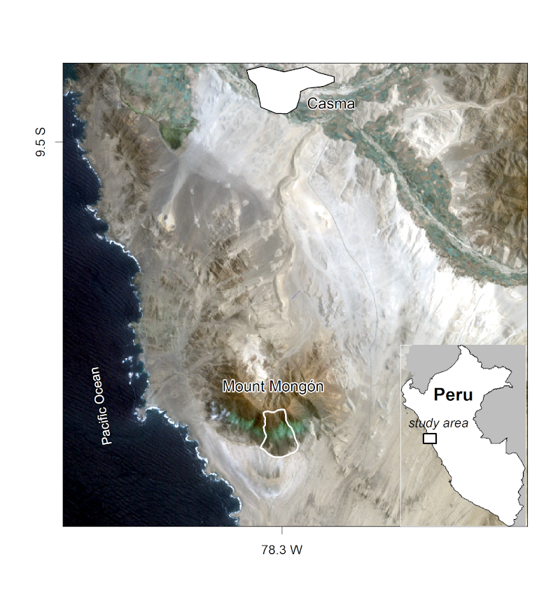
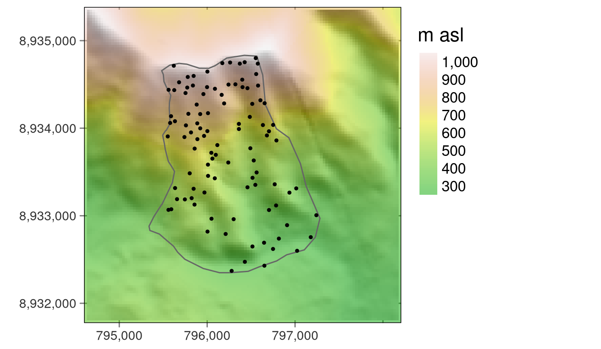
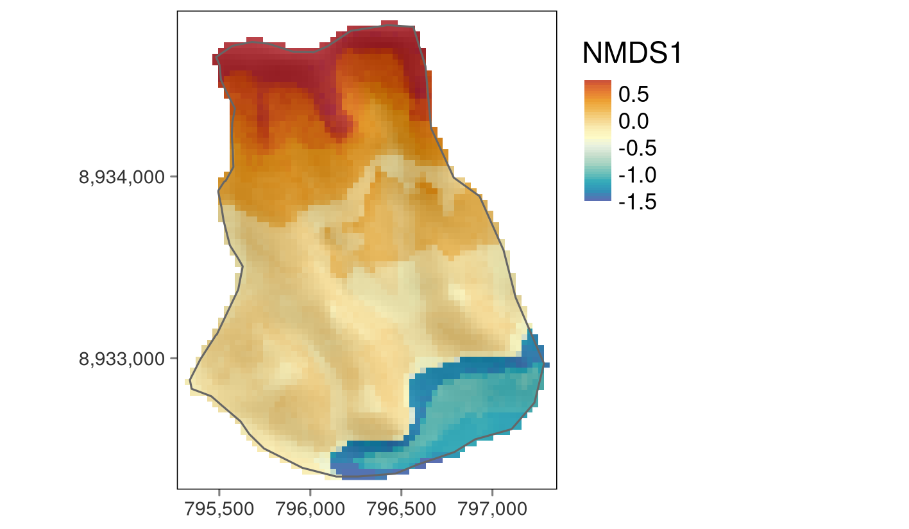

# Ecology

<details>
<summary>Abstract</summary>
This chapter models the floristic gradient of fog oases to reveal distinctive vegetation belts that are clearly controlled by water availability. The case study provides an opportunity to bring together and extend concepts presented in previous chapters to further enhance your skills at using R for geocomputation.

Fog oases, locally called lomas, are vegetation formations found on mountains along the coastal deserts of Peru and Chile. Similar ecosystems can be found elsewhere, including in the deserts of Namibia and along the coasts of Yemen and Oman (Galletti, Turner, and Myint 2016). Despite the arid conditions and low levels of precipitation of around 30-50 mm per year on average, fog deposition increases the amount of water available to plants during austral winter, resulting in green southern-facing mountain slopes along the coastal strip of Peru. The fog, which develops below the temperature inversion caused by the cold Humboldt current in austral winter, provides the name for this habitat. Every few years, the El Niño phenomenon brings torrential rainfall to this sun-baked environment, providing tree seedlings a chance to develop roots long enough to survive the following arid conditions (Dillon, Nakazawa, and Leiva 2003).

Unfortunately, fog oases are heavily endangered, primarily due to agriculture and anthropogenic climate change. Evidence on the composition and spatial distribution of the native flora can support efforts to protect remaining fragments of fog oases (Muenchow, Bräuning, et al. 2013; Muenchow, Hauenstein, et al. 2013). The chapter also demonstrates how to apply techniques covered in previous chapters to an important applied field: ecology.
</details>

In it you will analyze the composition and the spatial distribution of vascular plants (here referring mostly to flowering plants) on the southern slope of Mt. Mongón, a lomas mountain near Casma on the central northern coast of Peru



<details>
<summary>Methods</summary>
During a field study to Mt. Mongón, all vascular plants living in 100 randomly sampled 4x4 m2 plots in the austral winter of 2011 were recorded(Muenchow, Bräuning, et al. 2013). The sampling coincided with a strong La Niña event that year, as shown in data published by the National Oceanic and Atmospheric Administration (NOAA). This led to even higher levels of aridity than usual in the coastal desert and increased fog activity on the southern slopes of Peruvian lomas mountains.
</details>

For this, we will make use of a random forest model — a very popular machine learning algorithm (Breiman 2001). The model will allow us to make spatial distribution maps of the floristic composition anywhere in the study area.

```{r}
library("data.table")        # fast data.frame manipulation (used by mlr3)
library("dplyr")
library("mlr3")              # machine learning (see Chapter 12)
library("mlr3spatiotempcv")  # spatio-temporal resampling 
library("mlr3tuning")        # hyperparameter tuning package
library("mlr3learners")      # interface to most important machine learning packages
library("paradox")           # defining hyperparameter spaces
# library("qgisprocess")       # bridge to QGIS (Chapter 10)
library("ranger")            # random forest package
library("sf")
library("terra")
library("tree")              # decision tree package
library("vegan")             # community ecology package

sessionInfo()
```


## Data

```{r}
data("study_area", "random_points", "comm", package = "spDataLarge")
dem = rast(system.file("raster/dem.tif", package = "spDataLarge"))
ndvi = rast(system.file("raster/ndvi.tif", package = "spDataLarge"))
```

```{r}
study_area
```

```{r}
random_points
```

```{r}
# community matrix of visited sites and observed species
str(comm, give.attr = FALSE)
```

```{r}
dem #digital elevation model
```

```{r}
ndvi #Normalized Difference Vegetation Index
```



## Preprocessing

The next step is to compute variables

* modeling and predictive mapping
* aligning the Non-metric multidimensional scaling (NMDS) axes with the main gradient in the study area, altitude and humidity, respectively 

### Bridges to GIS Software

```{r, eval = FALSE}
qgisprocess::qgis_show_help("saga:sagawetnessindex")
#> Saga wetness index (saga:sagawetnessindex)
#> ...
#> ----------------
#> Arguments
#> ----------------
#> 
#> DEM: Elevation
#>  Argument type:  raster
#>  Acceptable values:
#>      - Path to a raster layer
#> ...
#> SLOPE_TYPE: Type of Slope
#>  Argument type:  enum
#>  Available values:
#>      - 0: [0] local slope
#>      - 1: [1] catchment slope
#> ...
#> AREA: Catchment area
#>  Argument type:  rasterDestination
#>  Acceptable values:
#>      - Path for new raster layer
#>... 
#> ----------------
#> Outputs
#> ----------------
#> 
#> AREA: <outputRaster>
#>  Catchment area
#> SLOPE: <outputRaster>
#>  Catchment slope
#> ...
```

```{r, eval = FALSE}
# environmental predictors: catchment slope and catchment area
ep = qgisprocess::qgis_run_algorithm(
  alg = "saga:sagawetnessindex",
  DEM = dem,
  SLOPE_TYPE = 1, 
  SLOPE = tempfile(fileext = ".sdat"),
  AREA = tempfile(fileext = ".sdat"),
  .quiet = TRUE)
```

```{r, eval = FALSE}
# read in catchment area and catchment slope
ep = ep[c("AREA", "SLOPE")] |>
  unlist() |>
  terra::rast()
names(ep) = c("carea", "cslope") # assign proper names 
terra::origin(ep) = terra::origin(dem) # make sure rasters have the same origin
ep = c(dem, ndvi, ep) # add dem and ndvi to the multilayer SpatRaster object
```

```{r, eval = FALSE}
ep$carea = log10(ep$carea) #since data was skewed right
```

### Site Locations

```{r}
# this raster was made available for convenience
ep = terra::rast(system.file("raster/ep.tif", package = "spDataLarge"))
```

```{r}
# terra::extract adds automatically a for our purposes unnecessary ID column
ep_rp = terra::extract(ep, random_points) |>
  select(-ID)
random_points = cbind(random_points, ep_rp)

str(ep_rp, give.attr = FALSE)
```


## Reducing Dimensionality

Ordinations are a popular tool in vegetation science to extract the main information, frequently corresponding to ecological gradients, from large species-plot matrices mostly filled with 0s. However, they are also used in remote sensing, the soil sciences, geomarketing and many other fields.

Resources: 

* [Ordination Methods overview](http://ordination.okstate.edu/overview.htm) by Michael W Palmer
* `vignette(package = "vegan")`

Techniques:

* **Principal component analysis (PCA)** is probably the most famous ordination technique. It is a great tool to reduce dimensionality if one can expect linear relationships between variables
* However,

    - nonlinear distribution (i.e. ideal conditions for plants)
    - the joint absence of a species in two plots is hardly an indication for similarity (i.e. two species both avoiding desert conditions)

* **Non-metric multidimensional scaling (NMDS)** is one popular dimension-reducing technique used in ecology (von Wehrden et al. 2009)

    - NMDS reduces the rank-based differences between the distances between objects in the original matrix and distances between the ordinated objects
    - The difference is expressed as `stress`
    - The lower the stress value, the better the ordination
    - Stress values lower than 10 represent an excellent fit, stress values of around 15 are still good, and values greater than 20 represent a poor fit (McCune, Grace, and Urban 2002)

## NMDS

NMDS (Non-metric multidimensional scaling) is an iterative procedure trying to make the ordinated space more similar to the input matrix in each step.
    
```{r}
# presence-absence matrix
pa = vegan::decostand(comm, "pa")  # 100 rows (sites), 69 columns (species)
# keep only sites in which at least one species was found
pa = pa[rowSums(pa) != 0, ]  # 84 rows, 69 columns
```

The resulting matrix serves as input for the NMDS. k specifies the number of output axes, here, set to 4.

```{r, message = FALSE, warning = FALSE}
set.seed(25072018)
nmds = vegan::metaMDS(comm = pa, k = 4, try = 500)
nmds$stress
```
A stress value of 9 [???] represents a very good result, which means that the reduced ordination space represents the large majority of the variance of the input matrix. 

Since humidity is highly correlated with elevation, we rotate the NMDS axes in accordance with elevation.

```{r}
elev = dplyr::filter(random_points, id %in% rownames(pa)) |> 
  dplyr::pull(dem)
# rotating NMDS in accordance with altitude (proxy for humidity)
rotnmds = vegan::MDSrotate(nmds, elev)
# extracting the first two axes
sc = vegan::scores(rotnmds, choices = 1:2, display = "sites")
# plotting the first axis against altitude
plot(y = sc[, 1], x = elev, xlab = "elevation in m", 
     ylab = "First NMDS axis", cex.lab = 0.8, cex.axis = 0.8)
```


## Floristic Gradient

To predict the **floristic gradient** spatially, we use a **random forest** model (Tomislav Hengl et al. 2018). Random forest models are frequently applied in environmental and ecological modeling, and often provide the best results in terms of predictive performance (Schratz et al. 2019)

```{r}
# construct response-predictor matrix
# id- and response variable
rp = data.frame(id = as.numeric(rownames(sc)), sc = sc[, 1])
# join the predictors (dem, ndvi and terrain attributes)
rp = inner_join(random_points, rp, by = "id")
```

**Decision trees** split the predictor space into a number of regions.

```{r}
tree_mo = tree::tree(sc ~ dem, data = rp)
plot(tree_mo)
text(tree_mo, pretty = 0)
```
## Tuning

* The response variable is *numeric*, hence a regression task will replace the classification task
* Instead of the AUROC which can only be used for categorical response variables, we will use the root mean squared error (RMSE) as performance measure
* We use a random forest model instead of a support vector machine which naturally goes along with different hyperparameters

Having already constructed the input variables (`rp`), we are all set for specifying the `mlr3`

```{r}
# create task
task = mlr3spatiotempcv::as_task_regr_st(select(rp, -id, -spri),
  id = "mongon", target = "sc")
```

```{r}
# one random forest with default hyperparameter settings
# e.g. proportion of observations, minimum node size
lrn_rf = lrn("regr.ranger", predict_type = "response")
```

```{r}
# specifying the search space
search_space = paradox::ps(
  mtry = paradox::p_int(lower = 1, upper = ncol(task$data()) - 1),
  sample.fraction = paradox::p_dbl(lower = 0.2, upper = 0.9),
  min.node.size = paradox::p_int(lower = 1, upper = 10)
)
```

```{r}
# workflow
autotuner_rf = mlr3tuning::AutoTuner$new(
  learner = lrn_rf,
  resampling = mlr3::rsmp("spcv_coords", folds = 5), # spatial partitioning
  measure = mlr3::msr("regr.rmse"), # performance measure
  terminator = mlr3tuning::trm("evals", n_evals = 50), # specify 50 iterations
  search_space = search_space, # predefined hyperparameter search space
  tuner = mlr3tuning::tnr("random_search") # specify random search
)
```

```{r, results = 'hide', message = FALSE, warning = FALSE}
# hyperparameter tuning
set.seed(0412022)
autotuner_rf$train(task) #produces many outputs
```

```{r}
autotuner_rf$tuning_result
```


## Prediction

```{r}
# predicting using the best hyperparameter combination
autotuner_rf$predict(task)
```

The `predict` method will apply the model to all observations used in the modeling. Given a multilayer `SpatRaster` containing rasters named as the predictors used in the modeling, `terra::predict()` will also make spatial distribution maps, i.e., predict to new data.

```{r, eval = FALSE}
pred_raster = terra::predict(ep, model = autotuner_rf, fun = predict)
plot(pred_raster)
```



<details>
<summary>Manually making predictions</summary>

```{r, eval = FALSE}
newdata = as.data.frame(as.matrix(ep))
colSums(is.na(newdata))  # 0 NAs
# but assuming there were 0s results in a more generic approach
ind = rowSums(is.na(newdata)) == 0
tmp = autotuner_rf$predict_newdata(newdata = newdata[ind, ], task = task)
newdata[ind, "pred"] = data.table::as.data.table(tmp)[["response"]]
pred_2 = ep$dem
# now fill the raster with the predicted values
pred_2[] = newdata$pred
# check if terra and our manual prediction is the same
all(values(pred - pred_2) == 0)
```


</details>


## Meeting Videos

### Cohort 1

`r knitr::include_url("https://www.youtube.com/embed/URL")`

<details>
<summary> Meeting chat log </summary>

```
LOG
```
</details>
